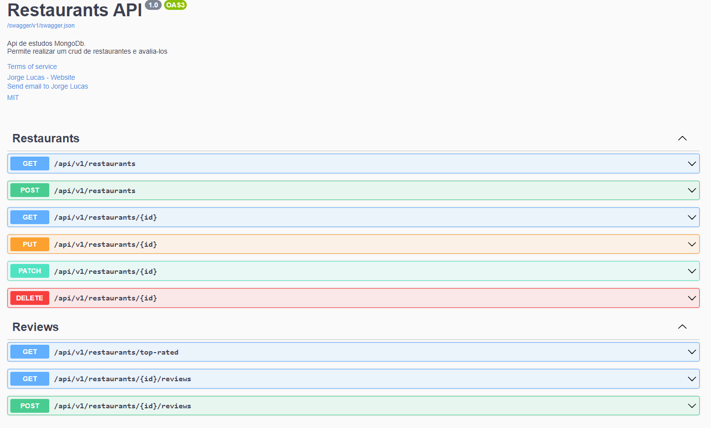

<h1 align="center">  Restaurants Api - MongoDb </h1>

<p align="center">
 <a href="#-sobre-o-projeto">Sobre</a> •
 <a href="#%EF%B8%8F-funcionalidades">Funcionalidades</a> •
 <a href="##-swagger-da-apii">Swagger da api</a> •
 <a href="#-como-executar-o-projeto">Como executar</a> • 
 <a href="#-tecnologias">Tecnologias</a> • 
 <a href="#-recursos-utilizados">Recursos utilizados</a> • 
</p>


## 💻 Sobre o projeto

api criada para servir de base de estudos sobre mongodb e mongodb driver


## ⚙️ Funcionalidades

- [x] Restaurants
  - [x] Cadastro 
  - [x] Listagem paginada e com filtros
  - [x] Busca por id
  - [x] Edição
  - [x] edição parcial
  - [x] Remoção
- [x] Reviews
  - [x] cadastrar review para um restaurant
  - [x] listar reviews de um restaurants
  - [x] listar os restaurants mais bem avaliados


## 🕮 Swagger da api



## 🚀 Como executar o projeto


### Pré-requisitos

Antes de começar, você vai precisar ter instalado em sua máquina as seguintes ferramentas:
[Git](https://git-scm.com) e [docker](https://www.docker.com/) 


#### 🧭 Executanto a aplicação

```bash

# Clone este repositório
$ git clone https://github.com/jorgelucasac/SampleMongoDB.git

# Acesso a pasta docker
$ cd SampleMongoDB/docker

# Execute a aplicação utilizando docker compose
$ docker-compose up -d


# A aplicação será executada na porta:5001 - acesse http://localhost:5001/swagger/index.html

```

## 🛠 Tecnologias

As seguintes ferramentes foram usadas na construção do projeto:


### **WebApi** ([dotnet 6](https://dotnet.microsoft.com/en-us/download/dotnet/6.0) + [docker](https://www.docker.com/) + [mongodb](https://www.mongodb.com/) )


## 📌 Recursos utilizados
 
- [Arquitetura limpa](https://blog.cleancoder.com/uncle-bob/2012/08/13/the-clean-architecture.html)
- [Injeção de Dependência](https://docs.microsoft.com/pt-br/aspnet/core/fundamentals/dependency-injection?view=aspnetcore-6.0)
- [mongodb driver c#](https://docs.mongodb.com/drivers/csharp/)
- [MediatR](https://github.com/jbogard/MediatR)
- [Padrão CQRS](https://martinfowler.com/bliki/CQRS.html)
- [Acesso ao banco de dados via Repositórios](https://www.martinfowler.com/eaaCatalog/repository.html)
- [Mapeamento de entidades com Automapper](https://automapper.org/)
- [Validação de utilizando fluent validation](https://fluentvalidation.net/)
- [Tratamento de erros](https://docs.microsoft.com/pt-br/aspnet/core/fundamentals/error-handling?view=aspnetcore-6.0)
- [Documentação com o Swagger](https://swagger.io/)
- [Serilog](https://serilog.net/)
